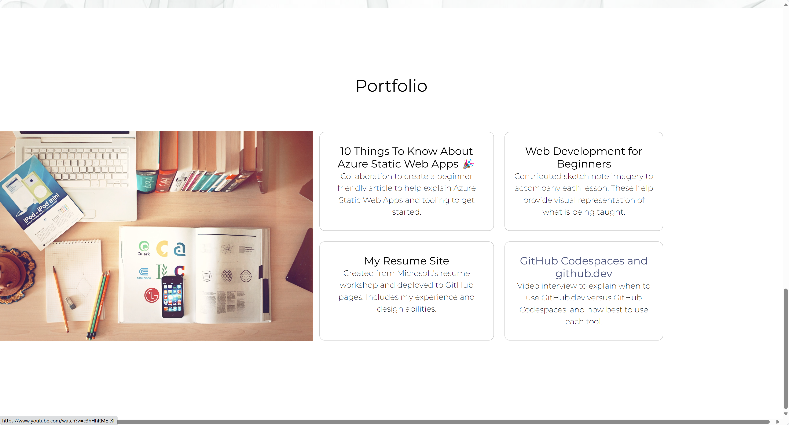

# Add `Portfolio` section

In this step, you will add a section called `Portfolio`. This section will display a list of projects you have worked on.

OK. Let's get started!

## Step 0: Restore the Blazor WebAssembly project

If you haven't completed the previous step or want to start from the save point, run the following commands to restore the Blazor WebAssembly project.

```bash
cd $CODESPACE_VSCODE_FOLDER
mkdir -p workshop && cp -a workshop-docs/save-points/step-03/. workshop/
cd workshop
```

## Step 1: Add `Portfolio` section to the `Home` component

We keep updating the `Home` component to include the `Portfolio` section. We'll split all the section into each component later in this workshop.

1. Open `MyPortfolio/Pages/Home.razor` and add the content just above the `@code {` line:

    ```csharp
    </section>
    
    @* ⬇️⬇️⬇️ Add codes below ⬇️⬇️⬇️ *@
        
    <section class="light" id="portfolio">
        <h2>Portfolio</h2>
        <div class="portfolio-container">
        @if (projects is null)
        {
            <p><em>Loading...</em></p>
        }
        else
        {
            <div class="portfolio-hero">
                @if (heroPortfolio is not null)
                {
                    
                }
            </div>
            <div class="container">
                @foreach (var project in projects)
                {
                    <div class="box" key="@project.Title">
                        <a href="@project.Url" target="_blank" rel="noopener noreferrer">
                            <h3 style="flex-basis: 40px;">@project.Title</h3>
                        </a>
                        <p class="small">@project.Description</p>
                    </div>
                }
            </div>
        }
        </div>
    </section>
        
    @* ⬆️⬆️⬆️ Add codes above ⬆️⬆️⬆️ *@
    
    @code {
    ```

1. Update the `@code { ... }` block to handle this `Portfolio` section. Replace the `@code { ... }` block with the following code:

    ```csharp
    @code {
        private SiteProperties? property;
        private HeroImage? heroHome;

        private AboutMe? aboutMe;
        private HeroImage? heroAboutMe;

        private List<Project>? projects;
        private HeroImage? heroPortfolio;
        
        protected override async Task OnInitializedAsync()
        {
            property = await Http.GetFromJsonAsync<SiteProperties>("sample-data/siteproperties.json");
    
            var heros = await Http.GetFromJsonAsync<List<HeroImage>>("sample-data/heroimages.json");
            heroHome = heros.SingleOrDefault(h => h.Name == "home");

            aboutMe = await Http.GetFromJsonAsync<AboutMe>("sample-data/aboutme.json");
            heroAboutMe = heros.SingleOrDefault(h => h.Name == "about");

            projects = await Http.GetFromJsonAsync<List<Project>>("sample-data/projects.json");
            heroPortfolio = heros.SingleOrDefault(h => h.Name == "portfolio");
        }
    }
    ```

## Step 2: Add `projects.json`

The `projects.json` file are base data to display your list of project details participated. We will add these files to the `wwwroot/sample-data` directory.

1. Make sure you're in the `workshop` directory.

    ```bash
    cd $CODESPACE_VSCODE_FOLDER/workshop
    ```

1. Create both files in the `wwwroot/sample-data` directory by running the following commands or on the codespace workspace on the side.

    ```bash
    touch MyPortfolio/wwwroot/sample-data/projects.json
    ```

1. Open `projects.json` and add the content as many projects as you want:

    ```json
    [
      {
        "title": "{{project-title}}",
        "description": "{{project-description}}",
        "url": "{{project-url}}"
      },
      {
        "title": "{{project-title}}",
        "description": "{{project-description}}",
        "url": "{{project-url}}"
      },
      {
        "title": "{{project-title}}",
        "description": "{{project-description}}",
        "url": "{{project-url}}"
      },
      {
        "title": "{{project-title}}",
        "description": "{{project-description}}",
        "url": "{{project-url}}"
      }
    ]
    ```

1. Open `heroimages.json` and replace the content with the following:

    ```json
    [
      {
        "name": "home",
        "src": "images/woman-with-tablet.jpg",
        "alt": "woman with glasses holding a tablet"
      },
      {
        "name": "about",
        "src": "images/motion-background.jpg",
        "alt": "gray abstract background"
      },
      {
        "name": "portfolio",
        "src": "images/design-desk.jpeg",
        "alt": "desktop with books and laptop"
      }
    ]
    ```

## Step 3: Add `Project` class

Reading JSON data in Blazor is done by creating classes that represent the JSON data. We will create `Project` class to represent the `projects.json` file.

1. Make sure you're in the `workshop` directory.

    ```bash
    cd $CODESPACE_VSCODE_FOLDER/workshop
    ```

1. Create both `Project` class in the `Models` directory by running the following commands or on the codespace workspace on the side.

    ```bash
    mkdir -p $CODESPACE_VSCODE_FOLDER/workshop/MyPortfolio/Models
    touch MyPortfolio/Models/Project.cs
    ```

1. Open `Project.cs` and add the following content:

    ```csharp
    namespace MyPortfolio.Models;
    
    public class Project
    {
        public string Title { get; set; } = string.Empty;
        public string Description { get; set; } = string.Empty;
        public string Url { get; set; } = string.Empty;
    }
    ```

## Step 4: Build and run the Blazor WebAssembly application

1. Make sure you're in the `workshop` directory.

    ```bash
    cd $CODESPACE_VSCODE_FOLDER/workshop
    ```

1. Build your Blazor WebAssembly project to make sure everything is working fine.

    ```bash
    dotnet build
    ```

1. Run the Blazor WebAssembly project to see the updated application on your web browser.

    ```bash
    dotnet watch run --project MyPortfolio
    ```

1. The updated application is open, and should look like below.

    

1. Stop the running application by pressing `Ctrl + C` in the terminal.

---

Congratulations! You have added the `Portfolio` component in the `Home` component. In the next step, you will add a header and footer.

:point_right: [Step 5: Create a Header and footer component](./05-header-footer-component.md)
